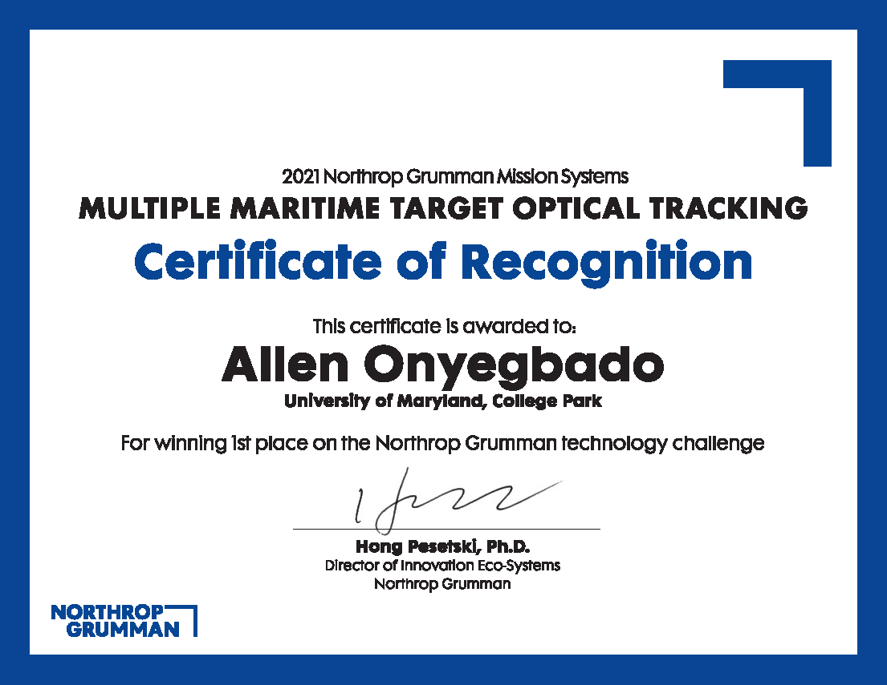
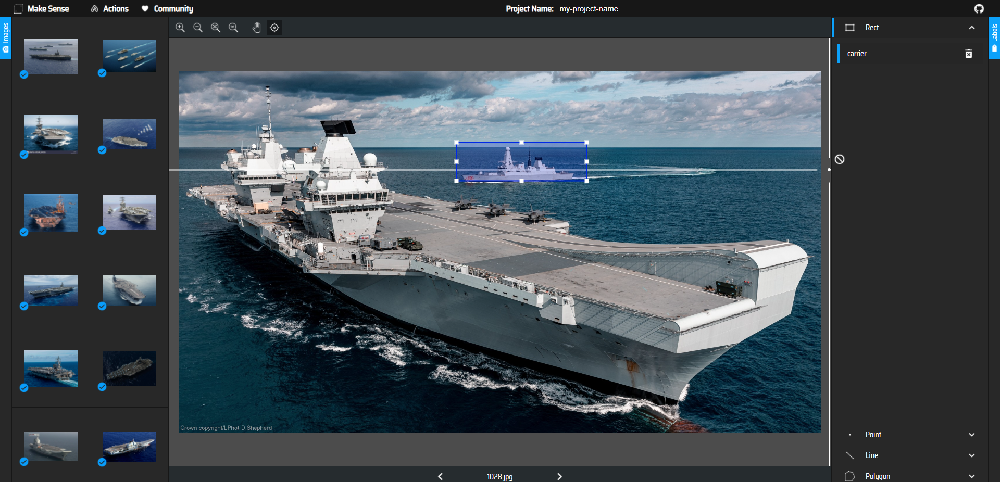

# Northrop Grumman Maritime Optical Tracking Challenge

      

[MTech Competition Website](http://mtech.umd.edu/ng/challenges/northrop-grumman-mission-systems-innovation-challenge-multiple-maritime-target-optical-tracking.html
 "Competition Website") 

 
Competed in a Northrop Grumman Competition sponsored and hosted at UMD and placed 1/15 teams of 1-4. Developed a Python/MATLAB application to detect, classify, and enumerate a variety of maritime vessels in real-time. More specifically, the application kept an accurate frame-by-frame catalogue of such vessels, and categorized them into civilians, warships, aircraft carriers, and submarines each with a numerical identifier. 

A csv file was also generated for accuracy checking. The competition spanned a 6 week period, and mentor meetings were biweekly. Research on object detection and utilization of open source machine learning software such as YOLOv5 and Google Colab were used to supplement project success. Custom training and testing data was gathered from Google and Bing Images. 

Research was also needed on tracking, as inaccuracies/frame drops within the models needed reconcilation. Originally planed to use Kalman Filter (linear quadratic estimation) for filling in prediction frame gaps. Settled with naive Eucledian distance "last seen" data structure due to time constraints. 

## Demos

  
  
  
  
  
  

## Screenshots

  
  
  
  
  
  
  
  
  

